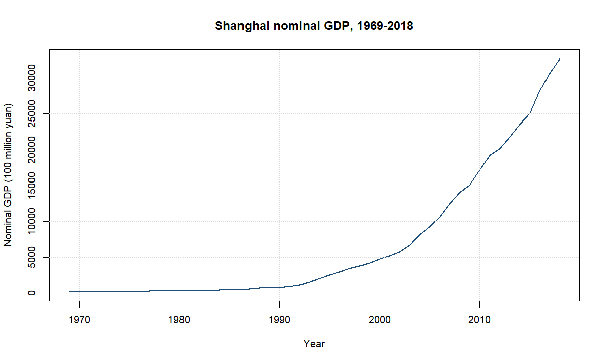
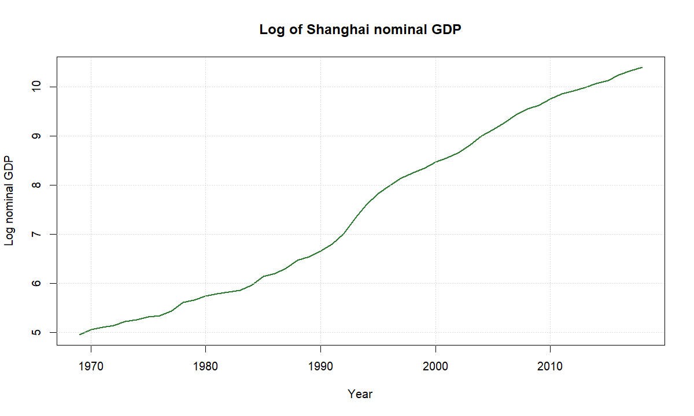
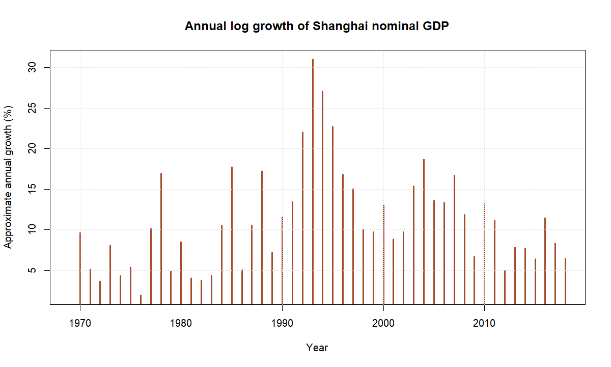
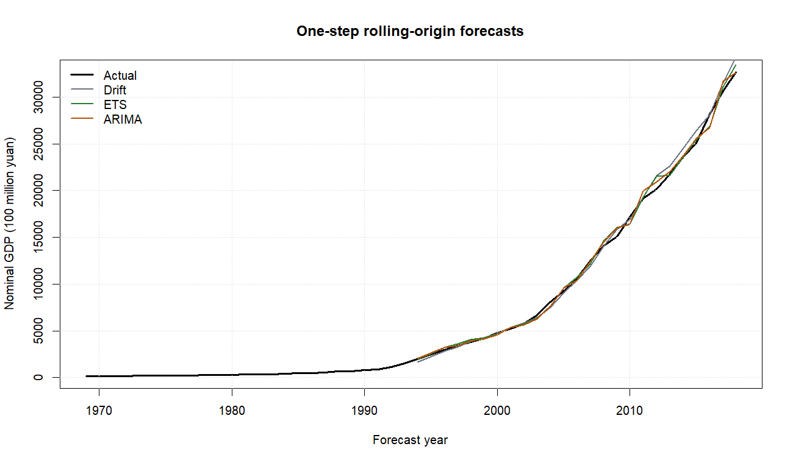
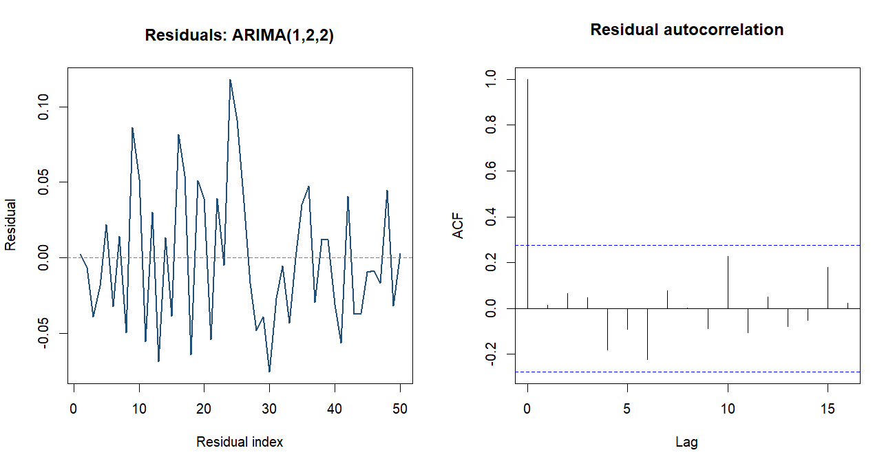
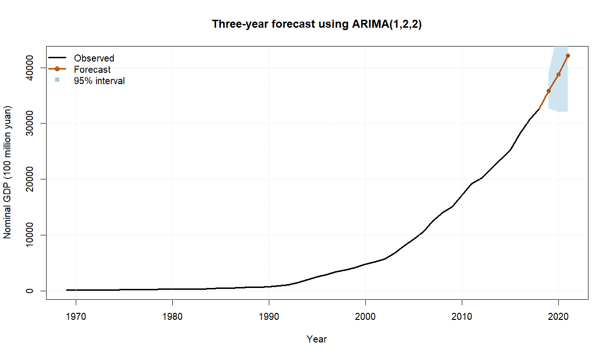

# Shanghai GDP forecasting

## Research question

How accurately can simple time-series models forecast Shanghai nominal GDP using only its historical annual values?

## Data

The dataset contains 50 annual observations from 1969 through 2018. GDP is recorded in 100 million yuan. The source is the data appendix of the original course paper. The series is treated as nominal GDP, so the results describe monetary scale rather than real economic growth.

## Models and validation

The comparison includes a random walk with drift, Holt exponential smoothing, and an ARIMA model selected by AICc from a small candidate grid. Models are evaluated with expanding-window, one-step-ahead forecasts. The first 25 observations form the initial training window, after which each next year is predicted using only earlier data.

| Model | Forecasts | MAE | RMSE | MASE | 95% coverage |
|---|---:|---:|---:|---:|---:|
| arima | 25 | 381.53 | 525.86 | 0.298 | 100.0% |
| ets | 25 | 386.48 | 532.64 | 0.302 | 100.0% |
| drift | 25 | 450.30 | 638.20 | 0.352 | 96.0% |

The lowest rolling RMSE is produced by **arima**. It is refitted on the complete sample for the final three-year demonstration forecast.

## Diagnostics

The final model is ARIMA(1,2,2). The Ljung-Box test uses lag 8 and gives p = 0.3083.
The test does not provide sufficient evidence of remaining residual autocorrelation.

## Demonstration forecast

| Year | Forecast | Lower 95% | Upper 95% |
|---:|---:|---:|---:|
| 2019 | 35819.17 | 32725.48 | 39205.33 |
| 2020 | 38763.64 | 32052.31 | 46880.24 |
| 2021 | 42168.76 | 32066.53 | 55453.59 |

## Limitations

- The data end in 2018 and should not be interpreted as a current forecast.
- Nominal GDP combines real output growth and price changes.
- Annual data provide a small sample and cannot represent short-run economic dynamics.
- Exponentiating log forecasts produces median forecasts on the original scale; no log-normal bias adjustment is applied.
- The models use no external economic information or structural-break variables.

The forecast is therefore a reproducible model-comparison exercise rather than policy guidance.
